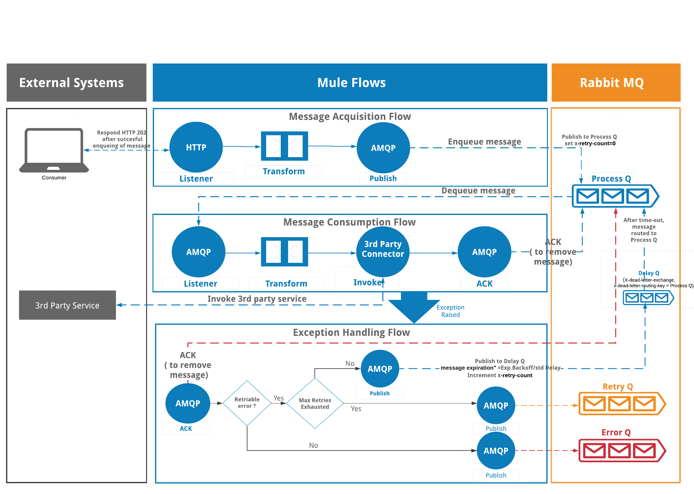
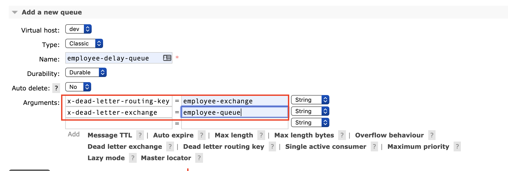

# Reliable Messaing Using Rabbit MQ

This is an example API to showcase how reliable messaging can be achieved using RabbitMQ as a messaging platform

### Why?
When working on layered architecture (API Led is a good example) it doesn't make sense to propagate the incoming requests when we know that some component of this architecture is not working correctly. This policy provides an entry point for the consumer, preventing spreading calls through the different layers, giving time to failing resources to recover.

### How?

The following diagram should articulate how this can be implemented:

This ensure that every application that uses this policy has isolated circuit state values.

### Usage
To test this example, you will require access to RabbitMQ. If not you can install it locally:

For RabbitMQ installation instructions please follow the link below :-
https://www.rabbitmq.com/download.html

After successful installation you should be able to run it Using

export PATH=$PATH:/usr/local/opt/rabbitmq/sbin
sudo rabbitmq-server

To access Rabbit MQ use the following url :-
http://localhost:15672/

Create Queues and Exchanges as per your configuration file.

When creating delay queue, ensure you configure "dead letter exchange" and "dead letter routing key" as shown below :-

#### Development

##### Dependencies

### Contribution

Just fork the repo, make your updates and open a pull request!

### Todos

License
----
UNLICENSED
